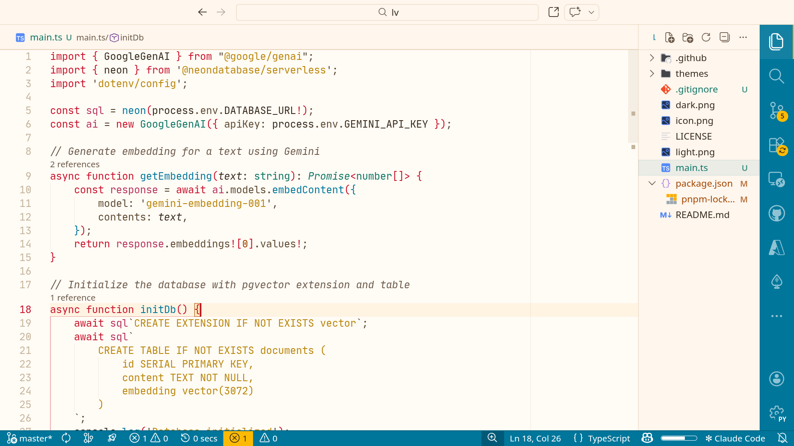
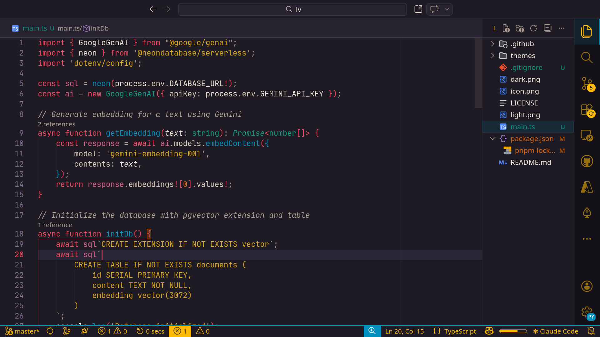

# Fabulous Las Vegas

A VS Code color theme inspired by the iconic *Welcome to Fabulous Las Vegas Nevada* sign — in day and night editions.

## Themes

- **Fabulous Las Vegas — High Noon** (light)
- **Fabulous Las Vegas — After Dark** (dark)

### Preview

| High Noon (light) | After Dark (dark) |
|------------------|-------------------|
|  |  |

## Installation

1. Open VS Code
2. Go to **Extensions** (`Ctrl+Shift+X`)
3. Search for **Fabulous Las Vegas**
4. Click **Install**
5. Open the Command Palette (`Ctrl+Shift+P`) and select **Preferences: Color Theme**
6. Choose **Fabulous Las Vegas — High Noon** or **Fabulous Las Vegas — After Dark**

### From source

```bash
git clone <repo-url> ~/.vscode/extensions/fabulous-las-vegas
```

Restart VS Code and select the theme from **Preferences: Color Theme**.

## Color Palette

| Color          | Role                     | Day       | Night     |
|----------------|--------------------------|-----------|-----------|
| Roulette Red   | Keywords, tags           | `#C9122B` | `#F0455D` |
| Fabulous Blue  | Functions                | `#00769B` | `#0090BE` |
| Vegas Teal     | Types, classes           | `#0C7566` | `#0E9783` |
| Fremont Gold   | Strings                  | `#946800` | `#B17C00` |
| Sunset Orange  | Numbers                  | `#A04500` | `#DD5F00` |
| Flamingo Pink  | Constants, decorators    | `#B5325E` | `#D45D85` |
| Rat Pack Sand  | Comments                 | `#7D6D5E` | `#958372` |
| Desert Earth   | Foreground               | `#352A1D` | `#E8DDD0` |
| Fremont Neon   | UI accents               | `#FCBA05` | `#FCBA05` |

All syntax colors meet **WCAG AA** contrast requirements (minimum 4.5:1).

## Publishing (CI)

Publishing to the [Visual Studio Marketplace](https://marketplace.visualstudio.com/) and the [Open VSX Registry](https://open-vsx.org/) is automated with GitHub Actions. The extension is **packaged once**, then **published to both registries in parallel**.

### Setup

1. **Visual Studio Marketplace** — Create a [Personal Access Token](https://code.visualstudio.com/api/working-with-extensions/publishing-extension#get-a-personal-access-token) (Azure DevOps / marketplace) with **Marketplace (Publish)** scope. Add a repo secret: `VS_MARKETPLACE_TOKEN`.

2. **Open VSX Registry** — [Create an Eclipse account](https://accounts.eclipse.org/user/register), link GitHub, sign the [Publisher Agreement](https://open-vsx.org/user-settings/profile), then create an [access token](https://open-vsx.org/user-settings/tokens). Create the namespace once (replace `alpharomercoma` and `<token>`):
   ```bash
   npx ovsx create-namespace -p alpharomercoma <token>
   ```
   Add a repo secret: `OPEN_VSX_TOKEN`.

3. In the repo: **Settings → Secrets and variables → Actions** and ensure both `VS_MARKETPLACE_TOKEN` and `OPEN_VSX_TOKEN` are set.

### How to release

- **Option A — Bump version and publish:** **Actions → Bump Version** → Run workflow, choose `patch` / `minor` / `major`. The workflow bumps `package.json`, pushes the commit, creates a tag (e.g. `v0.1.2`), and **Release & Publish Extension** runs and publishes to both marketplaces in parallel.

- **Option B — Publish an existing version:** Create a [GitHub Release](https://docs.github.com/en/repositories/releasing-projects-on-github/managing-releases-in-your-repository) with a tag like `v0.1.2` (or push a tag: `git tag v0.1.2 && git push origin v0.1.2`). **Release & Publish Extension** sets `package.json` version from the tag and publishes to both registries.

## Author

**Alpha Romer Coma** — [alpharomercoma@proton.me](mailto:alpharomercoma@proton.me)

## License

[MIT](LICENSE)
